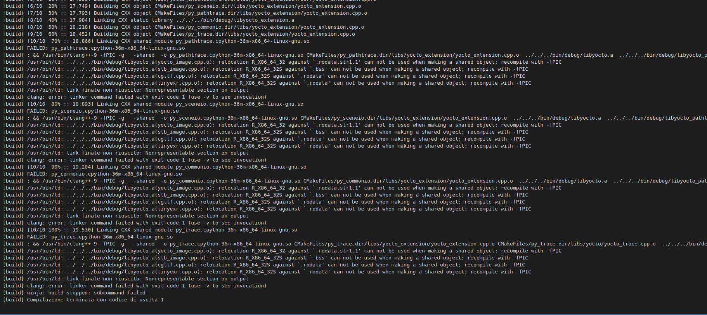

# Installation
On linux:
```bash
sudo apt install pybind11-dev
```

Follow the guide of the official repository for the requirements: https://github.com/pybind/pybind11

# Include pybind lib
Clone the repo inside libs folder and add submodule:
```bash
git submodule add https://github.com/pybind/pybind11
git submodule init
git submodule update
```
https://github.com/pybind/pybind11/issues/1817

# Install correctly pybind11
```bash
cd pybind11
mkdir build
cd build
cmake ..
make install
```

# How to create a module
1. Insert the pybindmodule in the principal cmakelists.txt, and the libs in the cmakelist of yoctoextension (otherwise it will blow up)

## Cmake changes
To allow
```
CMake Error at libs/yocto_extension/CMakeLists.txt:13 (target_link_libraries):
      Attempt to add link library "yocto" to target "py_commonio" which is not
      built in this directory.
    
      This is allowed only when policy CMP0079 is set to NEW.
```
we have setted:
`cmake_policy(SET CMP0079 NEW)`  
See: [link to issue](https://gitlab.kitware.com/cmake/cmake/issues/19693)


# Error with yocto_sceneio
To avoid the error below, while creating a new module for yocto_sceneio:  
  
we had to include all the yocto cpp file:  
  

# How to build yocto
```bash
pip install . --no-cache-dir
```