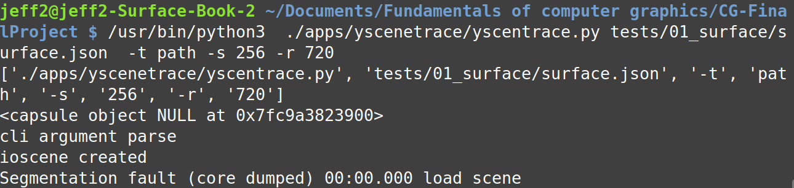
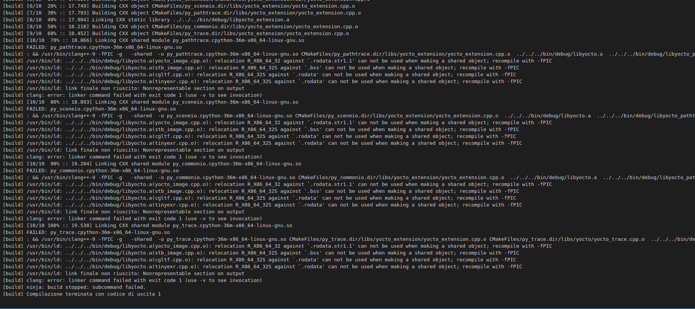
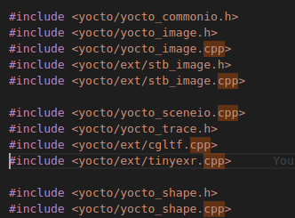

# USING PYBIND11 TO IMPORT YOCTO TO PYTHON
Salvatore Cognetta - 1874383  
Daniele Appetito - 1916560

# Disclaimer
This project is still not 100% functional, we have been trying everything to fix it, but haven't been able to come up with a solution.

# Installation
On linux:
```bash
sudo apt install pybind11-dev
```
Follow the guide of the official repository for the requirements: https://github.com/pybind/pybind11
# Include pybind lib
Clone the repo inside libs folder and add submodule:
```bash
git submodule add https://github.com/pybind/pybind11
git submodule init
git submodule update
```
https://github.com/pybind/pybind11/issues/1817

# Install correctly pybind11
```bash
cd pybind11
mkdir build
cd build
cmake ..
make install
```
# How to build yocto
Now it's possible to build yocto with the python install manager pip:
```bash
pip install . --no-cache-dir
```

# How to create a module
Insert the pybindmodule in the principal cmakelists.txt, and the libs in the cmakelist of yoctoextension (otherwise it will blow up)

# Task
We were asked to create a python binding to the main Yocto functionality by writing a set of Python scripts interpreting already existing files in Yocto. More specifically we were asked to create 'yscenetrace.py', `ysceneproc.py', 'yimageproc.py', and 'yshapeproc.py' by binding functions enclosed in the corresponding ".cpp" files to Python, using pybind11.

# What was done
As instructed we downloaded pybind11 and linked it to the yocto library. We wrote the list of bindings inside "yocto_extension.cpp" as told, creating a pybind11 module for each header file we bound (yocto_shapeio, yocto_image, yocto_commonio, yocto_pathtrace, yocto_sceneio, and filesystem). 
Inside the modules we added bindings to functions, overloaded functions, constants, classes/structures, and templates that were used by the 3 .py scripts.  
## CMake
In order for the pybind11 library to run we had to add lines in 2 CMakeLists.txt files to link everything together:
```Cmake
      set(PYBIND11_CPP_STANDARD -std=c++1z) # Experimental C++17 support
      add_subdirectory(libs/pybind11)
```
The above code was added in the main CMakeLists.txt file in order to point it to the pybind11 library. On top of that, for every module created we had to add:
```Cmake
      pybind11_add_module()
```
with the name of the module and the file in which it was contained. 
(as yocto_extension was used for all the bindings we also had to add a pybind_add_module(yocto_extension) for it).
The second CMakeLists.txt we altered was the one in the yocto_extension directory, where we had to add:
```CMake
      target_include_directories(py_module PUBLIC ${CMAKE_SOURCE_DIR}/libs)
      target_link_libraries(py_module PRIVATE yocto)
```
replacing py_module with the name of each created module in yocto_extension.cpp (having one set of "target links" for each module)
## Cmake changes
To allow
```
CMake Error at libs/yocto_extension/CMakeLists.txt:13 (target_link_libraries):
      Attempt to add link library "yocto" to target "py_commonio" which is not
      built in this directory.
      This is allowed only when policy CMP0079 is set to NEW.
```
we have setted:
`cmake_policy(SET CMP0079 NEW)`  
See: [link to issue](https://gitlab.kitware.com/cmake/cmake/issues/19693)

# Error with stl containers in pybind11
To allow the use of PYBIND11_MAKE_OPAQUE function we had to move "namespace py = pybind11" outside of every namespace and we moved it upon yocto::extension aliases namespace.

# Error with parse_cli
Due to a segmentation fault in the parse_cli call:  

we had to create a workaround by creating a simplified parce_cli in python.
Main problem is in `*(std::string*)option.value = value; //*(std::string*) create the problem` inside 
`inline bool parse_cli(cli_state& cli, int argc, const char** argv, std::string& error)";` it looks like it cant convert the object into an std::string pointer.  
We tried with differen methods, like creating a lambda function that wraps the parse cli function and call directly from the cpp file (see [strackoverflow](https://stackoverflow.com/questions/49195418/pybind11-binding-a-function-that-uses-double-pointers)), but even with this method it doesn't seems to work.

# Error with yocto_sceneio
To avoid the error below, while creating a new module for yocto_sceneio (and others):  
  
we had to include all the all the yocto cpp file:  
  

# yscenetrace problem
The binding of yscenetrace.cpp file caused the majority of problems:
1. parce cli had to be redefined as we had problems with 
2. in init_subdivs a floating point exception was created inside eval_textures in pathtrace.cpp:

```cpp
auto ii = (i + 1) % size.x, jj = (j + 1) % size.y; //size is equal to (0,0)
```  

this happens because in the init_scene function, in the loop over ioscene.objects, set_subdiv_displacement function set a displacement_tex = `nullptr`, infact `texture_map[ioobject.material.displacement_tex]` is a `Null/None`, even if the texture_map is correctly created: 

```cpp
ptr.set_subdiv_displacement(subdiv_map[ioobject.subdiv],
      ioobject.material.displacement,
      texture_map[ioobject.material.displacement_tex])
```
we managed to dodge the problem, at least for testing purpose, creating a iotexture_tmp index inside the loop over ioscene.textures:

```cpp
for iotexture in ioscene.textures:
    if progress_cb:
      progress.x += 1
      progress_cb("convert texture", progress.x, progress.y)
    texture = ptr.add_texture(scene)
    # if ptr.texture_empty(texture, 'colorf'):
    if texture.colorf: 
      ptr.set_texture(texture, iotexture.colorf)
      size_colorf = img.image_vec3f.size(iotexture.colorf) 
      if size_colorf.x:
        iotexture_tmp = iotexture

      ...

      ptr.set_subdiv_displacement(subdiv_map[ioobject.subdiv],
            ioobject.material.displacement,
            texture_map[iotexture_tmp])
```

We then encountered another problem, however, in the pathtrace::trace_samples function, created inside the eval_camera, specifically at this line:

```cpp
auto p = dc * camera->focus / abs(dc.z);
```

Where the division by abd(dc.z) ended up giving a value of infinity. We tested it by printing out the value of dc.z:

```cpp
      cli::print_info("Inside eval_camera, dc.z: " + std::to_string(dc.z));
```
```cpp
      Inside eval_camera, dc.z: 0.983158
      Inside eval_camera, dc.z: 0.983204
      Inside eval_camera, dc.z: 0.983065
      Inside eval_camera, dc.z: 0.983240
      Inside eval_camera, dc.z: 0.983212
      Inside eval_camera, dc.z: 0.983251
      Inside eval_camera, dc.z: 0.983235
      Inside eval_camera, dc.z: 0.983272
      Inside eval_camera, dc.z: 0.983285
      Inside eval_camera, dc.z: 0.983204
      Inside eval_camera, dc.z: 0.983212
      Inside eval_camera, dc.z: 0.983170
      Inside eval_camera, dc.z: 0.983138
```
The above output repeated for several thousands of lines and then cut out, meaning we were not able to decypher where the value goes to 0. As such This problem remains unresolved.

# yshapeproc problem
In yshapeproc the problem is created inside the make_* functions, the vectors passed to them (such as quads, positions, etc.) are not being changed. To avoid this problem we have tried different possible solutions, such as exposing stl containers as native Python object, as stated in pybind documentation ([expose stl container](https://pybind11.readthedocs.io/en/stable/advanced/cast/stl.html#making-opaque-types)):

```cpp
PYBIND11_MAKE_OPAQUE(std::vector<int>);
PYBIND11_MAKE_OPAQUE(std::vector<float>);
PYBIND11_MAKE_OPAQUE(std::vector<yocto::math::vec2f>);
PYBIND11_MAKE_OPAQUE(std::vector<yocto::math::vec3f>);
PYBIND11_MAKE_OPAQUE(std::vector<yocto::math::vec2i>);
PYBIND11_MAKE_OPAQUE(std::vector<yocto::math::vec3i>);
PYBIND11_MAKE_OPAQUE(std::vector<yocto::math::vec4i>);
...
py::bind_vector<std::vector<int>>(m, "VectorInt", py::module_local(false));
py::bind_vector<std::vector<float>>(m, "VectorFloat", py::module_local(false));
py::bind_vector<std::vector<vec2f>>(m, "VectorVec2f", py::module_local(false));
py::bind_vector<std::vector<vec3f>>(m, "VectorVec3f", py::module_local(false));
py::bind_vector<std::vector<vec2i>>(m, "VectorVec2i", py::module_local(false));
py::bind_vector<std::vector<vec3i>>(m, "VectorVec3i", py::module_local(false));
py::bind_vector<std::vector<vec4i>>(m, "VectorVec4i", py::module_local(false));
```

but even with this method we ended up with the same empty vectors problem.